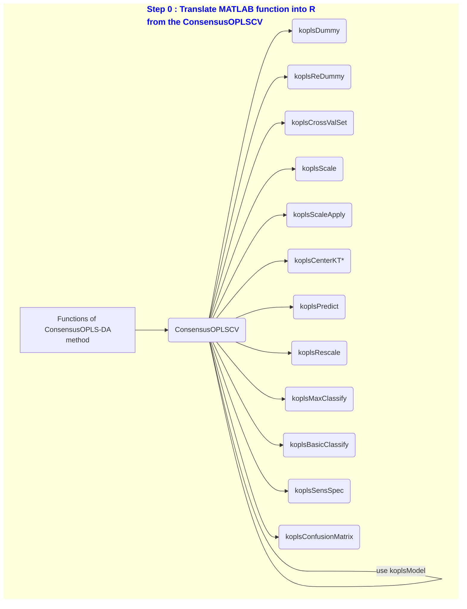

Overview of project stages:

To make it easier to read, we have reproduced the previous graph using the 
ConsensusOPLSCV function only.

This structure has been reproduced for the git tree: one branch per function 
and per code file. Next, the functions were tested on example datasets and 
verified. Finally, all the branches will be merged to finalize the method.

Once the method had been translated, verified and validated, it was tested 
on a real dataset.

(Coming soon)

The next step is to introduce variable selection to this ConsensusOPLS-DA 
method.

(Coming soon)