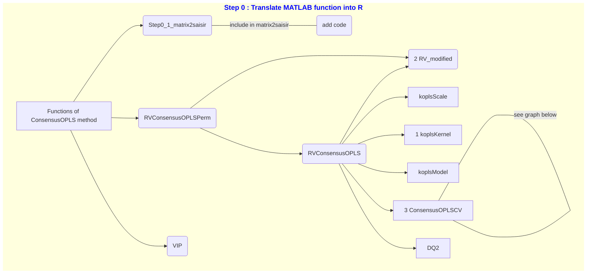
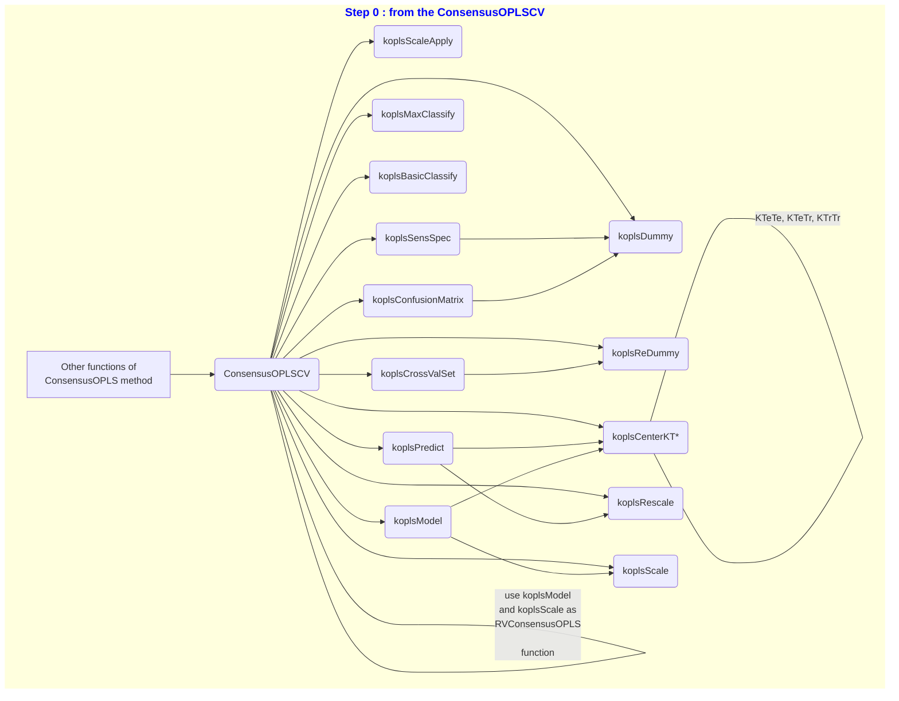
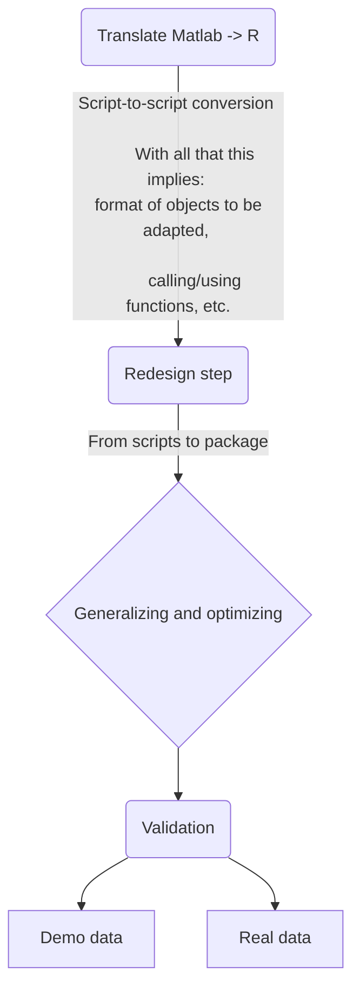

# Overview of project stages:

The aim of this project is to translate the `ConsensusOPLS` method from its 
original MATLAB version (available on the GitLab 
https://gitlab.unige.ch/Julien.Boccard/consensusopls) to an R version.

For this purpose, a mind map of the method's functions was created:

To make it easier to read, we have reproduced the previous graph using the 
ConsensusOPLSCV function only.

This structure has been reproduced for the git tree: one branch per function 
and per code file. Next, the functions were tested on example datasets 
(`demo_data` proposed by Julien Boccard in its Matlab version) and verified. 
Finally, all the branches will be merged to finalize the method.

A second folder has also been created. It is named `ConsensusOPLS`. It 
contains the publishable version of the R code, with the structure of a CRAN R 
package. In this folder, the previous codes are grouped by functionality. They 
have also been optimized. Gradually, only this folder is used for further 
package development.

# KOPLS R package

At the meeting on 09/10/2023, it turned out that the KOPLS package had already 
been translated into R. To avoid redundancy or errors, the source code of the 
kopls package was searched for. A version was found on the following GitHub: 
https://github.com/sdechaumet/ramopls/tree/master/inst/package (version of 
05/08/2020). Codes previously translated from Matlab to R were compared with 
those in the GitHub repository. References to the authors of the KOPLS package 
have been added at the start of each function's code.

# Partnership with Switzerland

The `main` branch of this project is shared with members of the Swiss 
Institute of Bioinformatics (SIB) on the following GitHub: 
https://github.com/sib-swiss/consensusOPLS. The other development branches are 
only available on the present GitLab repository.

# Package development

The development of the package can be summarized in the graph below:

Indeed, the first major step was to convert the Matlab scripts into R scripts. 
Switching from one language to another inevitably implies changes in code 
structure, object format, function calling or use, etc., and this is where we 
came in.

Next, we need to redesign the codes to move towards a package format. As 
mentioned above, this means grouping certain functions together for better 
comprehension, and unit testing the lowest levels of functions to ensure a 
certain quality of results. It also requires, among other things, building a 
helper, checking and partitioning input formats.

Once this first level of code validation had been achieved, we were able to 
work on adding functionality. For example, we adapted numerous mathematical 
formulas and restructured the code to reflect these changes. We modified the 
kernel type: in Matlab, the polynomial kernel could only be of order 1 (linear 
kernel). Now, the user can use a polynomial kernel of order greater than 1 
(non-linear) or Gaussian. Similarly, we've gone back to predictive components: 
in Matlab, the method allowed only one component. Now, the user can vary this 
number to determine the optimal model according to the type of data being 
analyzed. In both the previous and current versions, the number of orthogonal 
components can also be greater than 1.

Code optimization, which took place in parallel with the generalization of the 
method, concerned several points. Firstly, function by function. The codes were 
simplified, as were the output formats, to make them more suitable for R. 
Indeed, during translation, the objects were reproduced with their Matlab 
structure, which is not the most suitable and optimal in terms of computation 
time for R. Next, permutations were parallelized. This led to a restructuring 
of the various code levels, including the KOPLS functions, to facilitate 
execution.

Next, the validation stage was very important. Unit tests were carried out, 
as was the integration test that guided the previous stages. The aim was to 
ensure that what we were proposing on R would deliver exactly the same results 
as on Matlab. These tests do not take into account the new functionalities 
added. To achieve this integration, we used the demo dataset proposed by Julien 
Boccard in Matlab. This was followed by a validation phase on real data. To do 
this, different sets were tested (two sets of internal project data, not shown; 
one set on public data, from ProMetIS 
(https://github.com/IFB-ElixirFr/ProMetIS/tree/master)). In this way, we 
ensured that on these 3 real data sets, matlab and R results were strictly 
identical when reproducing similar code between the two software packages.

Finally, we've added everything that will enable a non-experienced user to 
use the method: R function help, execution progress displays, user-friendly 
results.

# Adding variable selection

The next step is to introduce variable selection to this ConsensusOPLS-DA 
method.

Step 1: before method utilisation.

Step 2: into the kernel construction.

(Coming soon)
