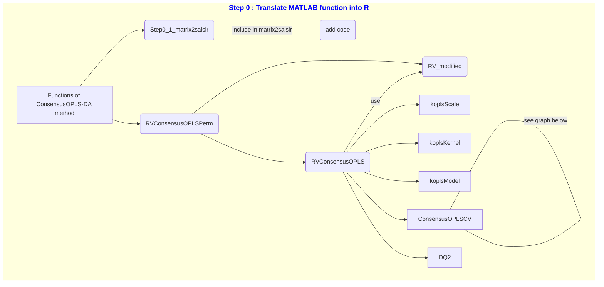
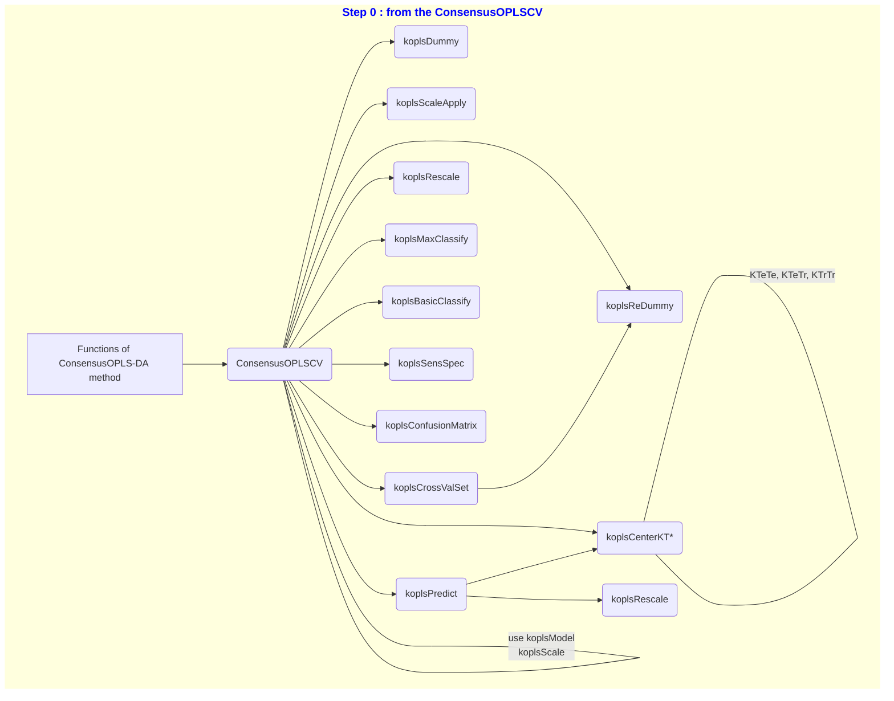

# Overview of project stages:

The aim of this project is to translate the `ConsensusOPLS` method from its 
original MATLAB version (available on the GitLab 
https://gitlab.unige.ch/Julien.Boccard/consensusopls) to an R version.

For this purpose, a mind map of the method's functions was created:

To make it easier to read, we have reproduced the previous graph using the 
ConsensusOPLSCV function only.

This structure has been reproduced for the git tree: one branch per function 
and per code file. Next, the functions were tested on example datasets 
(`demo_data` proposed by Julien Boccard in its Matlab version) and verified. 
Finally, all the branches will be merged to finalize the method.

# KOPLS R package

At the meeting on 09/10/2023, it turned out that the KOPLS package had already 
been translated into R. To avoid redundancy or errors, the source code of the 
kopls package was searched for. A version was found on the following GitHub: 
https://github.com/sdechaumet/ramopls/tree/master/inst/package (version of 
05/08/2020). Codes previously translated from Matlab to R were compared with 
those in the GitHub repository. References to the authors of the KOPLS package 
have been added at the start of each function's code.

# Partnership with Switzerland

The `main` branch of this project is shared with members of the Swiss Institute 
of Bioinformatics (SIB) on the following GitHub: 
https://github.com/sib-swiss/consensusOPLS. The other development branches are 
only available on the present GitLab repository.

# Method improvement

Once the method had been translated, verified and validated, it was tested 
on a real dataset.

(Coming soon)

The next step is to introduce variable selection to this ConsensusOPLS-DA 
method.

(Coming soon)
